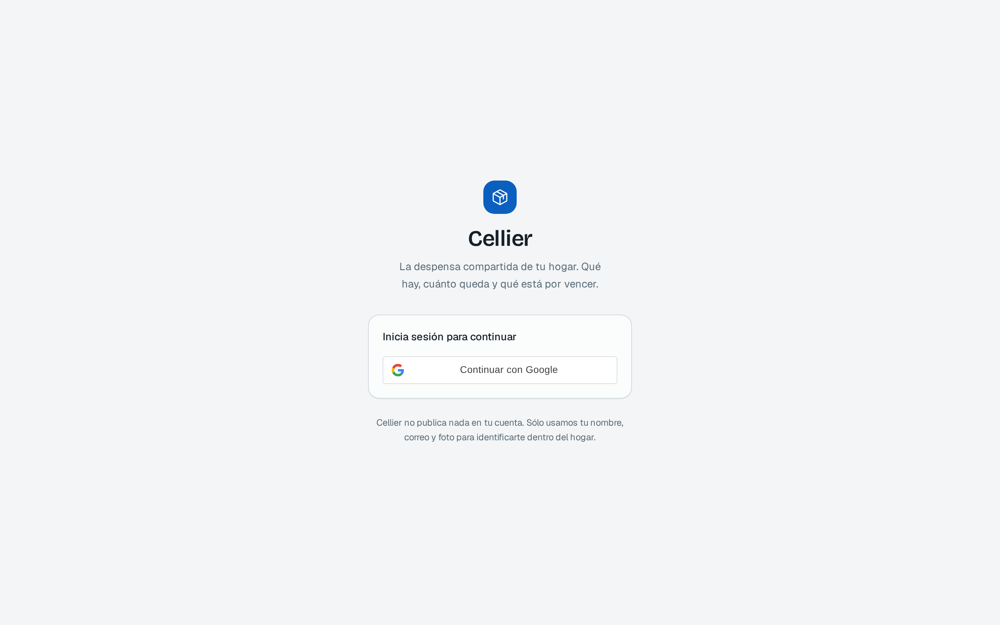
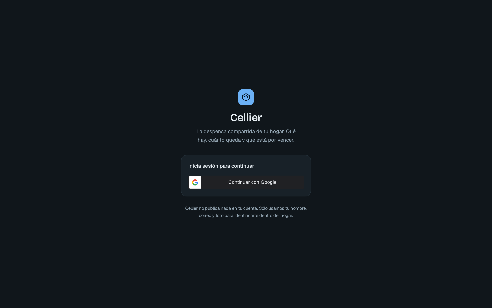
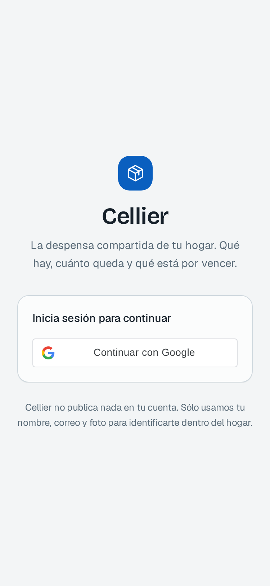
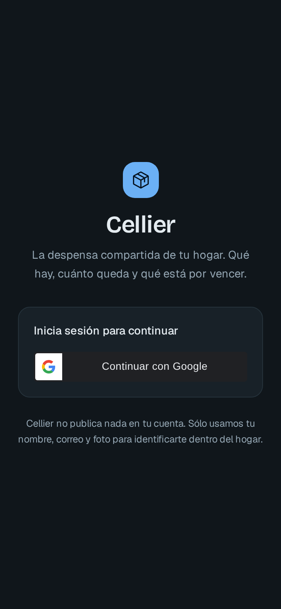
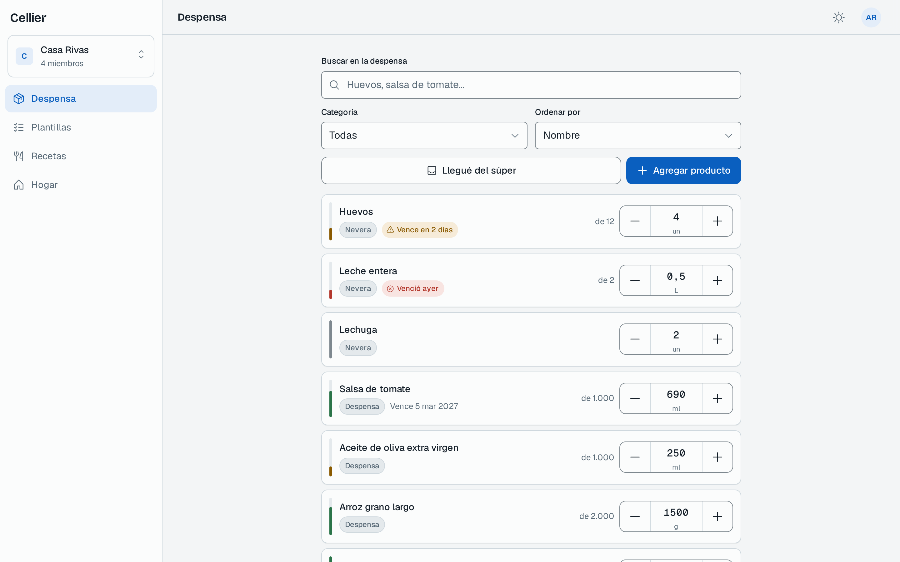
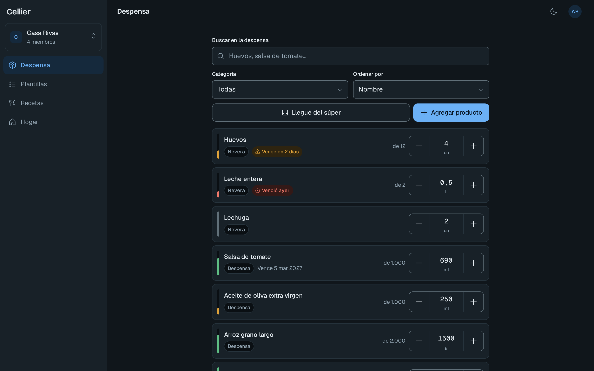
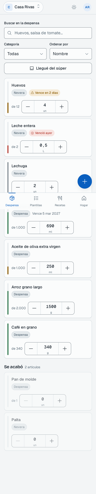
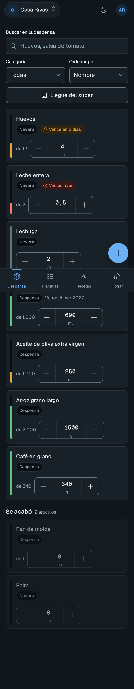

# Cellier

Web app monolítica para administrar la despensa compartida de un hogar.

Backend Spring Boot y frontend Angular viven en el mismo repositorio y se empaquetan en **un
único JAR**: el backend sirve la API REST y también los estáticos de la SPA.

```
.
├── backend/     Spring Boot 4.1.1 · Java 25 · Maven
├── frontend/    Angular 22 · standalone · signals · zoneless · TailwindCSS v4
├── docs/        ADRs y documentación de diseño
└── docker-compose.yml
```

## Capturas

Claro y oscuro, escritorio (1440px) y móvil (375px). Más capturas de verificación —onboarding,
gestión de miembros, estados vacíos y de carga— en [`docs/ui-shots/`](docs/ui-shots/).

| | Claro | Oscuro |
|---|---|---|
| **Login · escritorio** |  |  |
| **Login · móvil** |  |  |
| **Despensa · escritorio** |  |  |
| **Despensa · móvil** |  |  |

## Requisitos

| Herramienta | Versión | Nota |
|---|---|---|
| JDK | 25 o superior | el backend compila con `--release 25` |
| Node.js | 22 o superior | solo para trabajar el frontend en dev |
| Docker + Compose | reciente | para la base de datos |
| Maven | — | no hace falta instalarlo: usa `./mvnw` |

## Puesta en marcha

### 1. Variables de entorno (primer paso, antes de todo lo demás)

```bash
cp .env.example .env
```

Este paso no es opcional ni se puede posponer: **`.env` es la única fuente de
configuración local**, y la leen tanto Docker Compose como el backend. Sin él, Compose y
Spring caen a sus valores por defecto y, aunque hoy coinciden, cualquier ajuste que hagas
después sólo llegaría a la mitad del sistema.

Edita `.env` y pon una contraseña real en `DB_PASSWORD`. El archivo está en `.gitignore` y
no se versiona nunca.

#### El client id de Google va aquí, y solo aquí

`GOOGLE_CLIENT_ID` en `.env` es la **única fuente** del client id. El backend lo lee de ahí
y lo exige como `aud` de cada ID token; el frontend lo obtiene del mismo sitio porque
`npm start`, `npm run build` y `npm test` ejecutan antes `sync-env`, que genera
`frontend/src/environments/environment.development.ts` y `environment.prod.ts` a partir de
`.env`.

Esos dos archivos están en `.gitignore` y **nunca se editan a mano**: son artefactos
generados. Sus plantillas versionadas (`environment.development.example.ts` y
`environment.prod.example.ts`) documentan la forma del archivo por si prefieres escribirlo
tú. `environment.ts`, que sí se versiona, lleva el client id vacío a propósito: un valor con
pinta de real se copia a producción y nadie se entera hasta que el login devuelve 401.

Si backend y frontend usaran client ids distintos, el login fallaría con un 401 sin más
pista, porque el backend rechazaría el token por audiencia. Derivarlo de `.env` hace que esa
divergencia no pueda ocurrir.

> Un client id de OAuth para aplicación web **es público**: viaja en el bundle del navegador
> por diseño. Lo secreto es el *client secret*, que Cellier no usa ni necesita, porque valida
> el ID token contra el JWKS de Google en vez de hacer un intercambio de código.

> **Ojo con cambiar `DB_PASSWORD` después de haber levantado la base.** PostgreSQL fija la
> contraseña sólo la primera vez que inicializa su volumen. Si la cambias más tarde, el
> contenedor conserva la antigua y el backend fallará al conectar. Para aplicarla hay que
> recrear el volumen: `docker compose down -v && docker compose up -d`, lo que borra los
> datos.

### 2. Base de datos

```bash
docker compose up -d
```

Levanta PostgreSQL 16 con un volumen nombrado (`cellier-pgdata`), de modo que los datos
sobreviven a `docker compose down`. Para comprobar que está lista:

```bash
docker compose ps          # debe decir "healthy"
```

Para borrar también los datos: `docker compose down -v`.

#### Por qué el puerto es 5433 y no 5432

Postgres se publica en el host en **5433**, no en el 5432 de costumbre. Es deliberado: en
muchas máquinas de desarrollo ya hay un PostgreSQL instalado en el sistema escuchando en
5432, y el choque no se manifiesta como un conflicto de puertos sino como un error de
credenciales desconcertante:

```
FATAL: role "cellier" does not exist
```

El mensaje engaña porque el contenedor sí tiene ese rol. Lo que ocurre es que el backend
nunca llegó al contenedor: se conectó al Postgres del sistema, que obviamente no conoce a
`cellier`. Usar 5433 evita el solapamiento de raíz.

El valor está alineado en los tres sitios que lo mencionan (`.env.example`,
`docker-compose.yml` y el perfil `dev` de `application.yml`), y todos lo leen de la misma
variable `DB_PORT`. Si 5433 también está ocupado en tu máquina, cámbialo **sólo en `.env`**
y los tres lo seguirán.

### 3. Backend en desarrollo

```bash
cd backend
./mvnw spring-boot:run
```

Arranca en <http://localhost:8080> con el perfil `dev`. No hay que exportar nada a mano:
el backend lee `.env` por su cuenta mediante `spring-dotenv`, que lo carga como
PropertySource antes de crear la fuente de datos.

Detalles que conviene conocer:

- **Las variables reales del entorno mandan sobre `.env`.** La biblioteca inserta su
  PropertySource justo después de `systemEnvironment`, así que un `DB_PORT` exportado en la
  shell, o inyectado por el CI, gana. `.env` es el valor por defecto local, no una
  imposición.
- **`spring-boot:run` arranca con la raíz del repositorio como directorio de trabajo**
  (`workingDirectory` en el `pom.xml`), que es donde viven `.env` y `docker-compose.yml`.
  Por eso `./mvnw spring-boot:run` desde `backend/` y `java -jar` desde la raíz encuentran
  el mismo archivo.
- **Los tests no cargan `.env`.** Su base de datos la provee Testcontainers, y dejar que el
  archivo local se colara haría que las pruebas dependieran de la máquina.
- Si `.env` no existe, la aplicación arranca igual con los valores por defecto de
  `application.yml` (`ignore-if-missing`). En producción lo normal es no tener archivo y
  pasar variables de entorno reales.

Puntos de entrada:

| URL | Qué es |
|---|---|
| <http://localhost:8080/swagger-ui.html> | **Swagger UI**, documentación interactiva de la API |
| <http://localhost:8080/v3/api-docs> | Documento OpenAPI en JSON |
| <http://localhost:8080/api/v1/health> | Sondeo público: `{"status":"UP","service":"cellier"}` |
| <http://localhost:8080/actuator/health> | Sonda de Actuator |

### 4. Frontend en desarrollo

En otra terminal, con el backend ya corriendo:

```bash
cd frontend
npm install     # solo la primera vez
npm start
```

`npm start` ejecuta `sync-env` antes de levantar el servidor, así que el client id de Google
se toma del `.env` de la raíz sin ningún paso manual. Si aún no lo has configurado, la
aplicación arranca igual y `/login` avisa de que falta.

Sirve en <http://localhost:4200>. Las llamadas a `/api` se redirigen a
`http://localhost:8080` mediante `proxy.conf.json`, así que no hay CORS que configurar.

La pantalla inicial es un marcador de posición: consulta `/api/v1/health` y muestra si
alcanza al backend. Sirve para confirmar que el proxy funciona.

## Construir el JAR único

```bash
cd backend
./mvnw -Pfrontend clean package
```

El perfil `frontend` instala una toolchain de Node aislada (en `backend/.frontend-toolchain`,
sin tocar el Node del sistema), ejecuta `npm ci` y el build de producción de Angular, y copia
el resultado a `target/classes/static`.

```bash
java -jar target/cellier-0.0.1-SNAPSHOT.jar
```

Con eso, <http://localhost:8080> sirve la SPA y la API desde el mismo proceso. Las rutas del
router de Angular funcionan al recargar la página: las rutas desconocidas se reenvían a
`index.html`, sin interceptar `/api/**`, `/swagger-ui/**`, `/v3/api-docs/**` ni `/actuator/**`.

Sin el perfil `-Pfrontend`, `./mvnw clean package` construye solo el backend (más rápido para
iterar en la API).

## Despliegue

La aplicación se despliega como **una sola imagen de contenedor**: el mismo proceso sirve la
API y la SPA. La plataforma de destino es [Railway](https://railway.app), que construye desde
el `Dockerfile` de la raíz, inyecta el puerto por `PORT` y conecta un servicio PostgreSQL
aparte.

### Construir la imagen

```bash
docker build --build-arg GOOGLE_CLIENT_ID=<tu client id real> -t cellier .
```

Dos etapas, Java 25 en ambas (la misma versión que `<java.version>` en `backend/pom.xml`):

1. **Build** — `eclipse-temurin:25-jdk`. Ejecuta `./mvnw -Pfrontend package -DskipTests`, que
   descarga Node, construye Angular y deja la SPA en `target/classes/static`, dentro del JAR.
   Imagen Debian y no Alpine a propósito: el Node que descarga `frontend-maven-plugin` está
   enlazado contra glibc y en musl no arranca. Por el mismo motivo la etapa instala
   `libatomic1`, sin el cual Node 26 muere con `error while loading shared libraries`.
2. **Runtime** — `eclipse-temurin:25-jre`, usuario sin privilegios, solo el JAR.

`GOOGLE_CLIENT_ID` va como *build arg* porque `frontend/scripts/sync-environment.mjs` lo
**inlina en el bundle de Angular** en tiempo de compilación. No es un secreto en sentido
estricto —viaja al navegador en cada carga— pero no se versiona. El script da prioridad a la
variable de entorno sobre el `.env`, y no falla si el archivo no existe: justo el caso del
contenedor.

La imagen final lleva `JAVA_TOOL_OPTIONS=-XX:MaxRAMPercentage=75`. Sin eso la JVM mira la
memoria del **host** y no la del contenedor, calcula un heap que no cabe, y el proceso muere
por OOM del cgroup sin dejar ni un stacktrace.

### Probar la imagen en local

```bash
docker network create cellier-prueba
docker run -d --name cellier-pg --network cellier-prueba \
  -e POSTGRES_DB=cellier_prod -e POSTGRES_USER=cellier_prod \
  -e POSTGRES_PASSWORD=clave-de-prueba postgres:16-alpine

docker run --rm --name cellier-app --network cellier-prueba -p 9090:9090 \
  -e SPRING_PROFILES_ACTIVE=prod -e PORT=9090 \
  -e DB_HOST=cellier-pg -e DB_PORT=5432 -e DB_NAME=cellier_prod \
  -e DB_USER=cellier_prod -e DB_PASSWORD=clave-de-prueba \
  -e GOOGLE_CLIENT_ID=<el real> \
  -e JWT_SECRET="$(openssl rand -base64 48)" \
  cellier
```

Un `PORT` distinto de 8080 a propósito: es la única forma de comprobar que la aplicación lo
lee de verdad y no está escuchando en el puerto fijo.

### Variables de entorno en producción

La aplicación **no lee ningún `.env` en el contenedor**: todo llega por el entorno. En el
perfil `prod` las obligatorias no tienen valor por defecto, así que si falta una la
aplicación no arranca — y eso es deliberado: es preferible a arrancar con una contraseña de
desarrollo.

| Variable | ¿Obligatoria? | Por defecto | Qué es |
|---|---|---|---|
| `SPRING_PROFILES_ACTIVE` | **sí** | `dev` | Tiene que valer `prod`. Sin esto arranca en `dev`, con contraseñas de desarrollo |
| `DB_HOST` | **sí** | — | Host del PostgreSQL |
| `DB_PORT` | **sí** | — | Puerto del PostgreSQL |
| `DB_NAME` | **sí** | — | Nombre de la base |
| `DB_USER` | **sí** | — | Usuario |
| `DB_PASSWORD` | **sí** | — | Contraseña |
| `GOOGLE_CLIENT_ID` | **sí** | — | Client id de OAuth de Google. Se exige como `aud` de cada ID token. **Debe ser el mismo** que se pasó como build arg al construir la imagen, o el login falla con un token que el backend rechaza |
| `JWT_SECRET` | **sí** | — | Clave HMAC de los access token. **Mínimo 32 bytes.** Genera una con `openssl rand -base64 48` y no reutilices la del `.env.example`: está en el repositorio y cualquiera podría firmar tokens válidos |
| `PORT` | no | `8080` | Puerto de escucha. Railway lo inyecta solo; en local no hace falta |
| `JWT_ISSUER` | no | `https://cellier.app` | Valor del claim `iss` de los tokens que emite Cellier |
| `DB_POOL_MAX` | no | `10` | Tamaño máximo del pool de Hikari |
| `LOG_LEVEL_CELLIER` | no | `INFO` | Nivel de log del paquete `com.cellier` |
| `MANAGEMENT_ENDPOINTS` | no | `health,info` | Endpoints de actuator expuestos por HTTP |
| `SWAGGER_UI_ENABLED` | no | `true` | Publicar Swagger UI en `/swagger-ui.html` |
| `API_DOCS_ENABLED` | no | `true` | Publicar el esquema OpenAPI en `/v3/api-docs` |

`SERVER_PORT` **no se usa en `prod`**: ahí el puerto sale de `PORT`. Sigue funcionando en
`dev` y en `test`.

#### Si la plataforma es Railway

El servicio PostgreSQL de Railway publica sus credenciales con **otros nombres**
(`PGHOST`, `PGPORT`, `PGDATABASE`, `PGUSER`, `PGPASSWORD`) y un `DATABASE_URL` que **no es
una URL JDBC**. Hay que mapearlas a mano en las variables del servicio:

```
DB_HOST     = ${{Postgres.PGHOST}}
DB_PORT     = ${{Postgres.PGPORT}}
DB_NAME     = ${{Postgres.PGDATABASE}}
DB_USER     = ${{Postgres.PGUSER}}
DB_PASSWORD = ${{Postgres.PGPASSWORD}}
```

Como *healthcheck* se usa `/actuator/health`, que es público: no pide token y devuelve 200 en
cuanto la aplicación está lista. El resto de `/actuator/**` sí exige autenticación.

### Qué hace Flyway en el primer arranque

Contra una base vacía aplica las migraciones `V1` a `V6` y crea `flyway_schema_history`.
`spring.jpa.hibernate.ddl-auto` está en `validate`: Hibernate **no** modifica el esquema,
solo comprueba que coincide con las entidades. En `prod` el log de Flyway sale en INFO
aunque el resto esté en WARN, precisamente para poder leer ese primer arranque.

## Autenticación

Cellier usa Google Sign-In para identificar al usuario, pero **no** reutiliza el token de
Google como credencial de la API:

1. El frontend obtiene un ID token de Google Identity Services.
2. Lo envía a `POST /api/v1/auth/google`.
3. El backend valida ese ID token contra el JWKS de Google (firma, emisor, audiencia,
   vigencia y correo verificado) y emite **credenciales propias**: un access token JWT de
   15 minutos y un refresh token opaco de 30 días.
4. A partir de ahí, cada petición viaja con `Authorization: Bearer <accessToken>`.

Detalles que conviene conocer al integrar el cliente:

- **El refresh token rota.** Cada llamada a `/api/v1/auth/refresh` revoca el token
  presentado y entrega uno nuevo. Guarda siempre el último.
- **Reutilizar un refresh token gastado revoca todas las sesiones del usuario.** Es la
  respuesta a que ese token esté circulando fuera del cliente legítimo.
- En la base de datos solo vive el **SHA-256** del refresh token, nunca el valor en claro.
- Un 401 con detalle `Se requiere un access token válido` significa que no mandaste token;
  uno con `El access token no es válido o ha caducado` significa que toca refrescar.
- Los errores se devuelven como `application/problem+json` (RFC 9457) y nunca incluyen
  trazas de pila.

### Configurar el client id de Google

En la [consola de Google Cloud](https://console.cloud.google.com/apis/credentials) crea una
credencial OAuth 2.0 de tipo *aplicación web*, añade `http://localhost:4200` a los orígenes
autorizados y copia el client id a tu `.env`:

```
GOOGLE_CLIENT_ID=123456789012-ejemplo.apps.googleusercontent.com
JWT_SECRET=$(openssl rand -base64 48)
```

Es el único sitio donde se pone: el frontend lo deriva de ahí (ver
[El client id de Google va aquí, y solo aquí](#el-client-id-de-google-va-aquí-y-solo-aquí)).
Tras cambiarlo, vuelve a arrancar el frontend para que `sync-env` regenere sus archivos.

Sin un `GOOGLE_CLIENT_ID` real, la aplicación arranca igual y el resto de la API funciona,
pero `POST /api/v1/auth/google` rechazará cualquier token con 401.

## Pruebas

```bash
cd backend  && ./mvnw test          # backend (usa Testcontainers: requiere Docker)
cd frontend && npx ng test --watch=false   # frontend
```

### End-to-end (Playwright)

```bash
cd frontend
npm run e2e          # headless, una vez
npm run e2e:ui        # modo interactivo de Playwright
```

`npm run e2e` levanta antes un Postgres efímero dedicado (`docker-compose.e2e.yml`, puerto
5555, **nunca** el de desarrollo) y arranca el backend con el perfil `test`, que habilita un
login sin pasar por Google y un endpoint de reseteo de esquema — ambos inexistentes fuera de
ese perfil. Al terminar, `global-teardown` baja el contenedor. No hace falta el backend ni el
frontend ya corriendo: Playwright arranca los suyos.

## Integración continua

[`.github/workflows/ci.yml`](.github/workflows/ci.yml) corre **en cada push a `main` y en
cada pull request**, con dos trabajos en paralelo:

| Trabajo | Qué hace |
|---|---|
| **Backend** | `actions/setup-java` con Temurin 25 y caché de Maven, y `./mvnw -B -ntp verify` desde `backend/` |
| **Frontend** | `actions/setup-node` con caché de npm sobre `frontend/package-lock.json`, y `npm ci`, `npm test` y `npm run build` desde `frontend/` |

Los dos son independientes a propósito: si el frontend falla, el resultado del backend sigue
siendo útil.

El trabajo del backend **no declara ningún servicio de base de datos**. La suite usa
Testcontainers, que levanta su propio PostgreSQL contra el Docker que ya trae
`ubuntu-latest`. Si algún día se cambia de runner, esto es lo primero que deja de funcionar.

### El secret que hace falta

| Secret | Dónde se define | Para qué |
|---|---|---|
| `GOOGLE_CLIENT_ID` | *Settings › Secrets and variables › Actions* | `sync-environment.mjs` lo inlina en el bundle durante `npm run build` |

Es el único. Si no está definido, el build de Angular **no falla** —genera un bundle sin
client id y sale con código 0—, así que el workflow lleva un paso extra que comprueba que el
client id aparece de verdad en `dist/`. Sin él, el pipeline pasaría en verde con un bundle
que no puede iniciar sesión.

### Lo que el pipeline no hace todavía

Los scripts del arnés visual —`frontend/scripts/shots.mjs` y
`frontend/scripts/verify-reachability.mjs`— **no corren en CI**. Necesitan un servidor de
desarrollo levantado, y el recorrido de alcanzabilidad solo ya tarda unos veinte minutos.

Queda como mejora futura, y no es trivial: haría falta arrancar `ng serve` como paso previo,
esperar a que responda, y recortar el recorrido para que quepa en un tiempo razonable. Hasta
entonces se ejecutan a mano antes de cerrar cada incremento de frontend, que es como se ha
venido haciendo.

## Perfiles de configuración

| Perfil | Cuándo | Comportamiento |
|---|---|---|
| `dev` | por defecto | valores por defecto pensados para el `docker-compose` de este repo; Swagger UI activo |
| `test` | `SPRING_PROFILES_ACTIVE=test` | para los E2E de Playwright: Postgres efímero del puerto 5555 y login sin Google |
| `prod` | `SPRING_PROFILES_ACTIVE=prod` | **sin valores por defecto**: si falta una variable, la app no arranca. Swagger UI y `/v3/api-docs` **encendidos** (requisito de entrega); el puerto lo toma de `PORT` |

Todas las variables están documentadas en `.env.example`.

En `prod` las variables se pasan por el entorno real (contenedor, systemd, plataforma). Un
`.env` presente también sirve, porque `spring-dotenv` lo carga en cualquier perfil, pero el
entorno real siempre tiene prioridad sobre el archivo.

## Convenciones del proyecto

- El esquema de base de datos se cambia **solo** con migraciones Flyway nuevas en
  `backend/src/main/resources/db/migration`. Una migración ya aplicada no se edita jamás.
- Las entidades JPA no cruzan la frontera de los controllers: siempre DTOs con Bean Validation.
- Todo endpoint nuevo se documenta con anotaciones OpenAPI en el mismo cambio en que se crea.
- Todo endpoint que recibe un `householdId` valida la membresía del usuario autenticado antes
  de tocar datos. Un hogar ajeno responde `404`, nunca `403`.
- El backend se organiza por feature: `identity`, `household`, `catalog`, `pantry`,
  `template`, `recipe`, más `shared` para lo transversal.

Las decisiones de arquitectura se registran en [`docs/adr/`](docs/adr/). La arquitectura
general (capas, módulos, despliegue, flujo de autenticación) está en
[`docs/arquitectura.md`](docs/arquitectura.md), y el modelo de datos completo en
[`docs/modelo-datos.md`](docs/modelo-datos.md).

Para contribuir —convención de ramas, Conventional Commits, definición de "terminado"— ver
[`CONTRIBUTING.md`](CONTRIBUTING.md).
