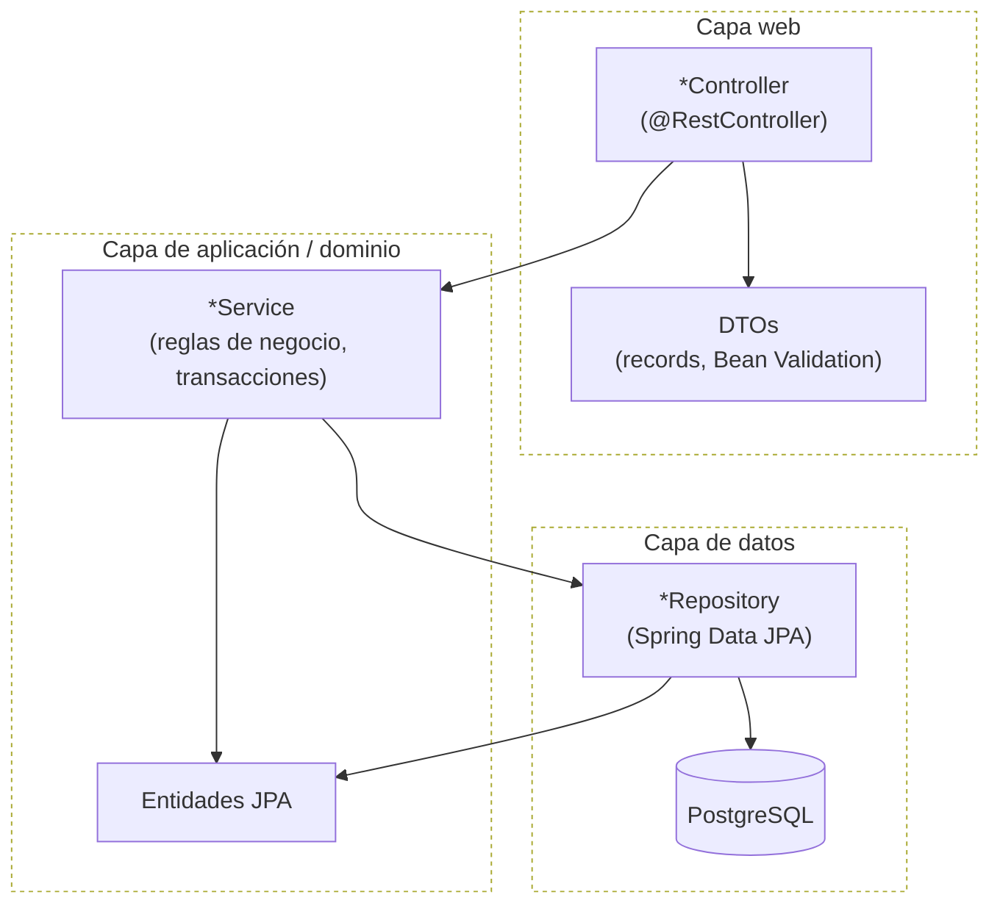
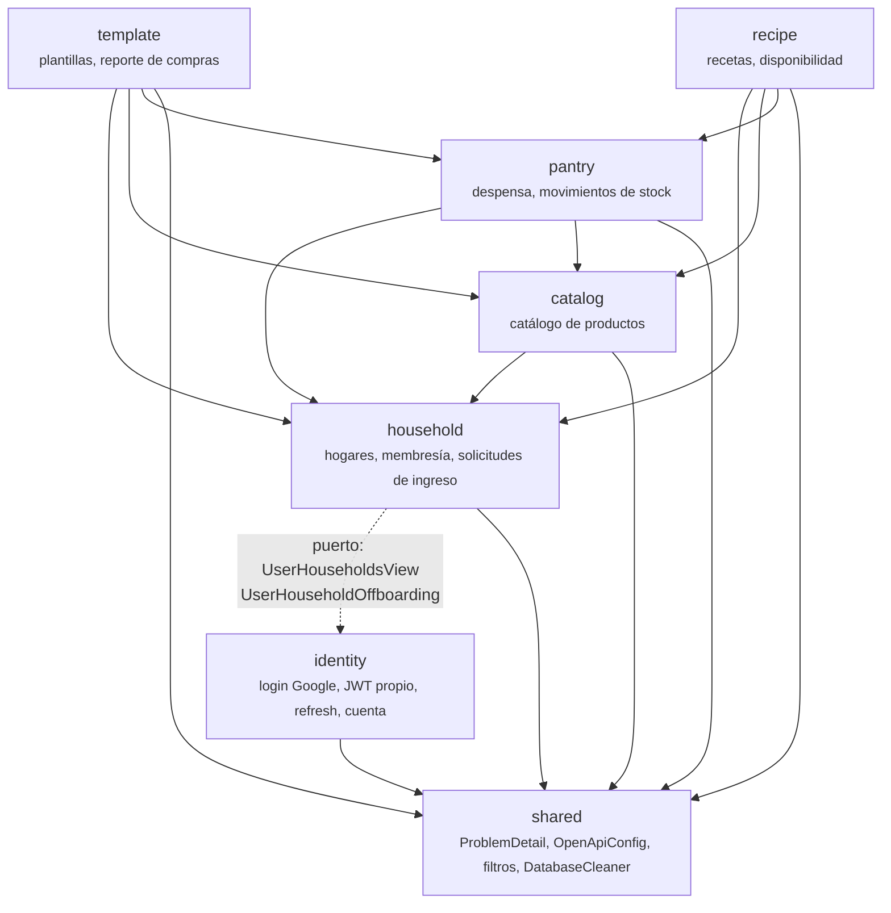
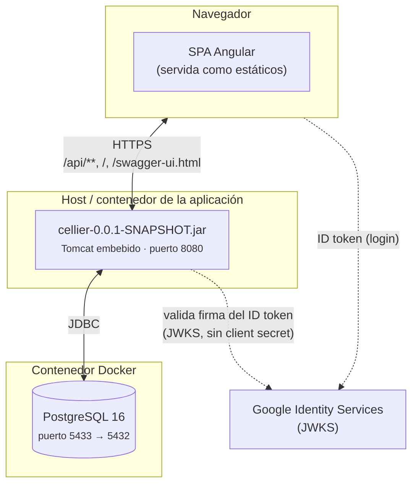
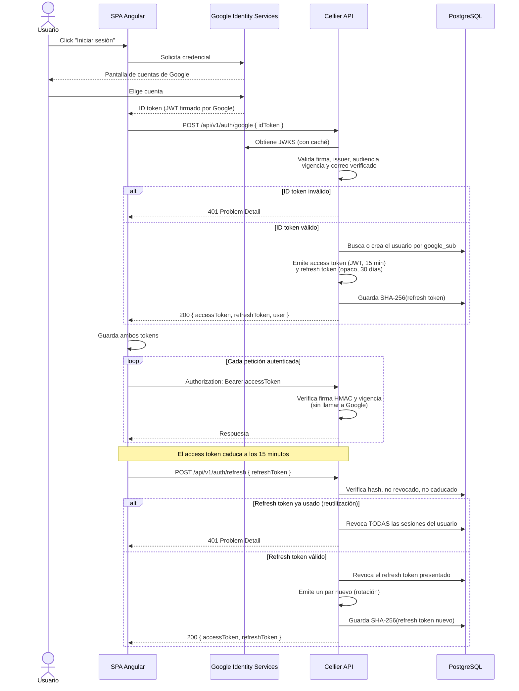

# Arquitectura

Cellier es un **monolito modular** (ver [ADR 012](adr/012-monolito-modular.md)): un único
proceso Spring Boot, empaquetado junto con la SPA de Angular en un solo JAR, organizado por
dominio en vez de por capa técnica transversal.

## Diagrama de capas

Dentro de cada módulo de dominio, el código se organiza en las mismas tres capas:

- Los **controladores** sólo traducen HTTP ↔ DTO y delegan toda regla de negocio al service.
  No hay lógica de dominio en un `@RestController`.
- Las **entidades JPA nunca cruzan la frontera del controlador**: lo que sale y entra por la
  API son siempre DTOs con Bean Validation, mapeados con MapStruct.
- El esquema de base de datos lo gobierna Flyway, no Hibernate (`ddl-auto: validate`, ver
  [ADR 019](adr/019-flyway-ddl-auto-validate.md)): la capa de datos valida contra migraciones
  versionadas, no las genera.

## Diagrama de módulos

**La flecha de `household` hacia `identity` es un puerto, no una dependencia directa.**
`identity` no importa nada de `household`: define interfaces (`UserHouseholdsView`,
`UserHouseholdOffboarding`) que `household` implementa, y las invoca a través de ellas. Así,
dar de baja una cuenta (en `identity`) puede desafiliarla de todos sus hogares (en `household`)
sin que el módulo de más bajo nivel dependa del de más alto nivel.

El resto de flechas son dependencias directas de servicio: por ejemplo, `pantry` consulta
`catalog` para resolver o crear un producto al dar de alta un artículo de despensa.

## Diagrama de despliegue

Un único artefacto desplegable: el JAR de Spring Boot sirve tanto la API REST como los
estáticos de la SPA (perfil Maven `frontend`, ver el README). No hay un servidor web separado
para el frontend ni un API Gateway: Tomcat embebido atiende ambos. La única pieza externa es
PostgreSQL, en su propio contenedor. Google sólo interviene en el intercambio inicial de login
(ver [ADR 013](adr/013-jwt-propio-sobre-google.md)); ninguna petición posterior a la API
depende de que Google esté disponible.

## Flujo de autenticación

Detalle completo del intercambio y de por qué el ID token de Google no se reutiliza como
credencial de la API en [ADR 013](adr/013-jwt-propio-sobre-google.md).
