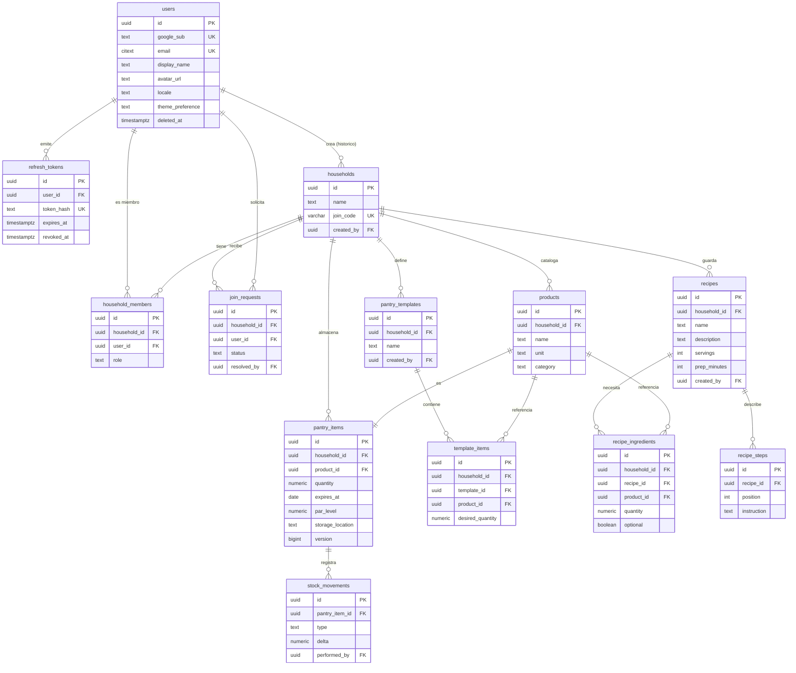

# Modelo de datos

Esquema gobernado por Flyway (`backend/src/main/resources/db/migration/V1`–`V6`); Hibernate
sólo valida (ADR 019). Las reglas que no se ven en un diagrama —por qué ciertas tablas llevan
`household_id` redundante, por qué algunas claves foráneas son compuestas— están en
[`reglas-esquema.md`](reglas-esquema.md).

## Diagrama entidad-relación

## Diccionario de datos

### `users`

Cuenta identificada por Google. Ver ADR 013.

| Columna | Tipo | Restricciones | Descripción |
|---|---|---|---|
| `id` | `uuid` | PK | Identificador interno. |
| `google_sub` | `text` | `UNIQUE`, `NOT NULL` | Claim `sub` del ID token de Google: identificador estable e inmutable de la cuenta. |
| `email` | `citext` | `UNIQUE`, `NOT NULL` | Correo, comparado sin distinguir mayúsculas. |
| `display_name` | `text` | `NOT NULL` | Nombre a mostrar. |
| `avatar_url` | `text` | — | Foto de perfil, de Google. |
| `locale` | `text` | `NOT NULL`, por defecto `es-CL` | Configuración regional. |
| `theme_preference` | `text` | `NOT NULL`, `IN ('SYSTEM','LIGHT','DARK')` | Preferencia de tema de la cuenta. |
| `deleted_at` | `timestamptz` | — | Borrado lógico. Con valor no nulo, el usuario no puede autenticarse. |

### `refresh_tokens`

Credenciales de sesión propias de Cellier. Ver ADR 013.

| Columna | Tipo | Restricciones | Descripción |
|---|---|---|---|
| `id` | `uuid` | PK | Identificador. |
| `user_id` | `uuid` | FK → `users.id` `ON DELETE CASCADE` | Titular del token. |
| `token_hash` | `text` | `UNIQUE`, `NOT NULL` | SHA-256 en hexadecimal del refresh token. El valor en claro nunca se persiste. |
| `expires_at` | `timestamptz` | `NOT NULL` | Vigencia: 30 días desde la emisión. |
| `revoked_at` | `timestamptz` | — | Momento de revocación (rotación o reutilización detectada). |

### `households`

Hogar, la unidad de agrupación de todo el resto del dominio.

| Columna | Tipo | Restricciones | Descripción |
|---|---|---|---|
| `id` | `uuid` | PK | Identificador. |
| `name` | `text` | `NOT NULL`, 1–80 caracteres | Nombre del hogar. |
| `join_code` | `varchar(8)` | `UNIQUE`, `NOT NULL`, alfabeto `A-HJKMNP-Z2-9` | Código de ingreso. Conocerlo no da acceso: abre una solicitud que un administrador debe aprobar. |
| `created_by` | `uuid` | FK → `users.id` | Quién lo creó. Es procedencia histórica, no autoridad: la autorización se resuelve siempre contra `household_members`. |

### `household_members`

Membresía y rol. Ver ADR 014 y ADR 018.

| Columna | Tipo | Restricciones | Descripción |
|---|---|---|---|
| `id` | `uuid` | PK | Identificador. |
| `household_id` | `uuid` | FK → `households.id` `ON DELETE CASCADE` | Hogar. |
| `user_id` | `uuid` | FK → `users.id` | Miembro. |
| `role` | `text` | `NOT NULL`, `IN ('ADMIN','MEMBER')` | Rol del usuario en **este** hogar. Un hogar mantiene siempre al menos un `ADMIN`. |
| `joined_at` | `timestamptz` | `NOT NULL` | Fecha de ingreso. |

Única: `(household_id, user_id)`.

### `join_requests`

Solicitud de ingreso a un hogar mediante su `join_code`.

| Columna | Tipo | Restricciones | Descripción |
|---|---|---|---|
| `id` | `uuid` | PK | Identificador. |
| `household_id` | `uuid` | FK → `households.id` `ON DELETE CASCADE` | Hogar solicitado. |
| `user_id` | `uuid` | FK → `users.id` | Solicitante. |
| `status` | `text` | `NOT NULL`, `IN ('PENDING','APPROVED','REJECTED','CANCELLED')` | Estado de la solicitud. |
| `requested_at` | `timestamptz` | `NOT NULL` | Fecha de la solicitud. |
| `resolved_at` | `timestamptz` | obligatorio si `status <> PENDING` | Fecha de resolución. |
| `resolved_by` | `uuid` | FK → `users.id`, obligatorio si `status <> PENDING` | Quién cerró la solicitud: el administrador que la aprobó/rechazó, o el propio solicitante si la canceló. |

Única parcial: una sola solicitud `PENDING` por `(household_id, user_id)`.

### `products`

Catálogo de productos del hogar. Ver ADR 015.

| Columna | Tipo | Restricciones | Descripción |
|---|---|---|---|
| `id` | `uuid` | PK | Identificador. |
| `household_id` | `uuid` | FK → `households.id` `ON DELETE CASCADE` | Hogar propietario. |
| `name` | `text` | `NOT NULL`, 1–120 caracteres, único por hogar sin distinguir mayúsculas | Nombre del producto. |
| `unit` | `text` | `NOT NULL`, `IN ('UNIT','G','KG','ML','L','PACK')` | Unidad canónica. No se convierte: todas las cantidades del sistema se expresan en ella. Inmutable tras la creación. |
| `category` | `text` | opcional | Agrupación visual en la despensa. |

Clave candidata redundante `(id, household_id)` para que `pantry_items`, `template_items` y
`recipe_ingredients` referencien el par (ver `reglas-esquema.md`).

### `pantry_items`

Lo que hay de un producto en la despensa del hogar. Una fila por `(household_id, product_id)`.

| Columna | Tipo | Restricciones | Descripción |
|---|---|---|---|
| `id` | `uuid` | PK | Identificador. |
| `household_id` | `uuid` | FK → `households.id` `ON DELETE CASCADE` | Hogar. |
| `product_id` | `uuid` | FK compuesta → `products (id, household_id)` | Producto. La FK compuesta impide que apunte a un producto de otro hogar. |
| `quantity` | `numeric(12,3)` | `NOT NULL`, `>= 0` | Cuánto hay, en la unidad del producto. |
| `expires_at` | `date` | opcional | Vencimiento del lote más próximo. Una fila por producto, no modela lotes separados (ADR 011). |
| `par_level` | `numeric(12,3)` | opcional, `> 0` si está presente | Cantidad que se considera "tener suficiente". |
| `storage_location` | `text` | opcional, `IN ('PANTRY','FRIDGE','FREEZER','OTHER')` | Dónde se guarda. |
| `version` | `bigint` | `NOT NULL`, por defecto `0` | Bloqueo optimista. Una colisión responde `409`, nunca sobrescribe en silencio. |

### `stock_movements`

Bitácora de cada cambio de cantidad.

| Columna | Tipo | Restricciones | Descripción |
|---|---|---|---|
| `id` | `uuid` | PK | Identificador. |
| `pantry_item_id` | `uuid` | FK → `pantry_items.id` `ON DELETE CASCADE` | Artículo afectado. |
| `type` | `text` | `NOT NULL`, `IN ('PURCHASE','CONSUMPTION','ADJUSTMENT')` | Tipo de movimiento. |
| `delta` | `numeric(12,3)` | `NOT NULL`, signo coherente con `type` | Cambio aplicado: negativo en `CONSUMPTION`, positivo en `PURCHASE`, distinto de cero en `ADJUSTMENT`. |
| `performed_by` | `uuid` | FK → `users.id`, opcional | Quién lo hizo. Nullable porque el movimiento sobrevive a su autor. |
| `performed_at` | `timestamptz` | `NOT NULL` | Momento del movimiento. |

### `pantry_templates`

Lista de deseos de cantidades por hogar. Ver ADR 017.

| Columna | Tipo | Restricciones | Descripción |
|---|---|---|---|
| `id` | `uuid` | PK | Identificador. |
| `household_id` | `uuid` | FK → `households.id` `ON DELETE CASCADE` | Hogar. |
| `name` | `text` | `NOT NULL`, 1–80 caracteres, único por hogar sin distinguir mayúsculas | Nombre de la plantilla. |
| `created_by` | `uuid` | FK → `users.id` `ON DELETE SET NULL`, opcional | Autoría histórica; cualquier miembro puede editar o borrar. |

### `template_items`

Línea de una plantilla: cuánto se desea de un producto.

| Columna | Tipo | Restricciones | Descripción |
|---|---|---|---|
| `id` | `uuid` | PK | Identificador. |
| `household_id` | `uuid` | `NOT NULL` | Redundante a propósito: permite que las dos FK de abajo se aten al par `(id, household_id)` y no sólo al `id` (ver `reglas-esquema.md`). |
| `template_id` | `uuid` | FK compuesta → `pantry_templates (id, household_id)` `ON DELETE CASCADE` | Plantilla. |
| `product_id` | `uuid` | FK compuesta → `products (id, household_id)` | Producto deseado. |
| `desired_quantity` | `numeric(12,3)` | `NOT NULL`, `> 0` | Cuánto se quiere tener. Cero no es un valor válido: es no tener la línea. |

Única: `(template_id, product_id)`.

### `recipes`

Receta del hogar.

| Columna | Tipo | Restricciones | Descripción |
|---|---|---|---|
| `id` | `uuid` | PK | Identificador. |
| `household_id` | `uuid` | FK → `households.id` `ON DELETE CASCADE` | Hogar. |
| `name` | `text` | `NOT NULL`, 1–120 caracteres | Nombre. Sin unicidad: dos recetas con el mismo nombre son variantes legítimas. |
| `description` | `text` | opcional, ≤ 2000 caracteres | Descripción libre. |
| `servings` | `int` | opcional, `> 0` | Porciones. |
| `prep_minutes` | `int` | opcional, `> 0` | Minutos de preparación. |
| `created_by` | `uuid` | FK → `users.id` `ON DELETE SET NULL`, opcional | Autoría histórica; cualquier miembro puede editar o borrar. |

### `recipe_ingredients`

Línea de ingrediente de una receta.

| Columna | Tipo | Restricciones | Descripción |
|---|---|---|---|
| `id` | `uuid` | PK | Identificador. |
| `household_id` | `uuid` | `NOT NULL` | Redundante a propósito, misma razón que `template_items.household_id`. |
| `recipe_id` | `uuid` | FK compuesta → `recipes (id, household_id)` `ON DELETE CASCADE` | Receta. |
| `product_id` | `uuid` | FK compuesta → `products (id, household_id)` | Producto. |
| `quantity` | `numeric(12,3)` | `NOT NULL`, `> 0` | Cuánto hace falta. |
| `optional` | `boolean` | `NOT NULL`, por defecto `false` | Un ingrediente opcional no cuenta para decidir si la receta está lista (`READY`/`MISSING`). |

Única: `(recipe_id, product_id)`.

### `recipe_steps`

Paso de preparación de una receta.

| Columna | Tipo | Restricciones | Descripción |
|---|---|---|---|
| `id` | `uuid` | PK | Identificador. |
| `recipe_id` | `uuid` | FK → `recipes.id` `ON DELETE CASCADE` | Receta. Sin `household_id` propio: sólo referencia una tabla de hogar, no hay nada que una columna redundante pudiera atar (ver `reglas-esquema.md`). |
| `position` | `int` | `NOT NULL`, `> 0` | Orden del paso. |
| `instruction` | `text` | `NOT NULL`, 1–1000 caracteres | Texto del paso. |

Única: `(recipe_id, position)`.
